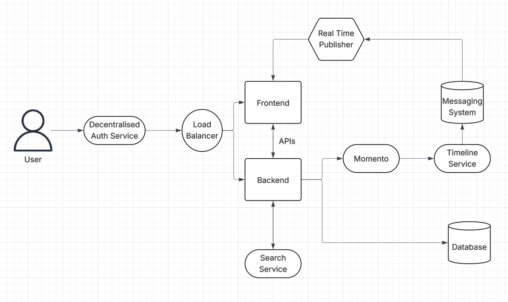
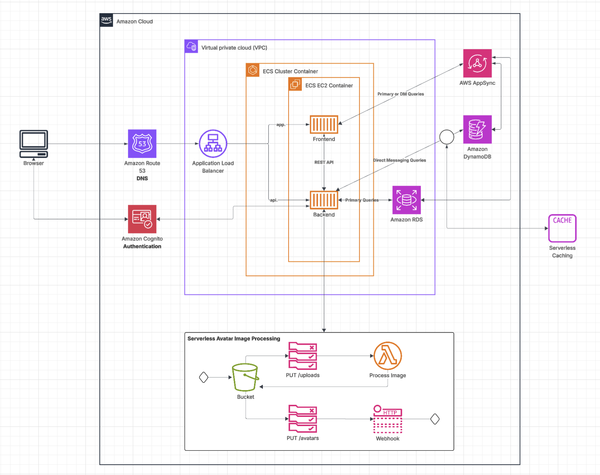

# Week 0 — Billing and Architecture

## Created an IAM User With Admin Privileges
I created an IAM user with username **admin-user**.
I added the user to a group (which I created in the process of creating the user) which I named **admin**.
I attached the policy **AdministratorAccess** to the group.
AWS auto assigned the policy **IAMUserChangePassword** to the group.

## Created a Cloudtrail Trail to Log Management Events
I created a cloudtrail trail with the name **management-events**.
It is a multi-region trail that logs all the management events.

## Setup AWS CLI in My Local Machine
I downloaded AWS CLI in my machine by following the instructions present in this document: https://docs.aws.amazon.com/cli/latest/userguide/getting-started-install.html
I configured the AWS CLI to use the IAM user that I had created
  I created an access key for the IAM user using AWS Console (IAM > Users > admin-user > Security credentials tab)
  I executed the command *aws configure* using AWS CLI and used the geneted access key and secret access key for the configuration
  I confirmed the setup using the command *aws sts get-caller-identity*

## Setup AWS Budget for Zero Spend
I created an AWS budget using AWS CLI. I used the following command:
`
aws budgets create-budget \
    --account-id AccountID \
    --budget file://aws/json/budget.json \
    --notifications-with-subscribers file://aws/json/budget-notifications-with-subscribers.json
`
The budget resets every month. The budgeted amount is $10 monthly and includes the spending using AWS credits.
I will receive email notification at two points: monthly spending reaching $8 (80% budget utilisation) and monthly spending reaching $10 (100% budget utilisation)
File [budget.json](../aws/json/budget.json)
File [budget-notifications-with-subscribers.json](../aws/json/budget-notifications-with-subscribers.json)

## Setup a Billing Alarm using AWS SNS
I created an SNS topic using the following command:
`aws sns create-topic --name billing-alarm`
The command returned a topic ARN. I then subscribed to the topic using the following command:
`aws sns subscribe --topic-arn TopicARN --protocol email --notification-endpoint myemail@provider.com`
I created a cloudwatch alarm using the following command:
`aws cloudwatch put-metric-alarm --cli-input-json file://aws/json/alarm_config.json`
The alarm checks the estimated daily spending once every 24 hours. If the estimate >= $1, message is published to the SNS topic (created in the first step).
File [alarm_config.json](../aws/json/alarm_config.json)

## Created a Conceptual Diagram for Cruddur
I created a conceptual diagram for cruddur using lucidchart.
[Link](https://lucid.app/lucidchart/75eca284-42ad-4d49-9ea5-15e749f46956/edit?viewport_loc=-1252%2C157%2C3859%2C2146%2C0_0&invitationId=inv_fe65ebe4-5d66-4b5b-96f5-dcd8b8428391)

## Recreated Logical Diagram for Cruddur
I created a logical diagram for cruddur using lucidchart.
[Link](https://lucid.app/lucidchart/b14520d8-d222-462e-a805-e314ed26aaa3/edit?invitationId=inv_5ebb51bf-b50e-41ca-8d72-bb3881351898)

